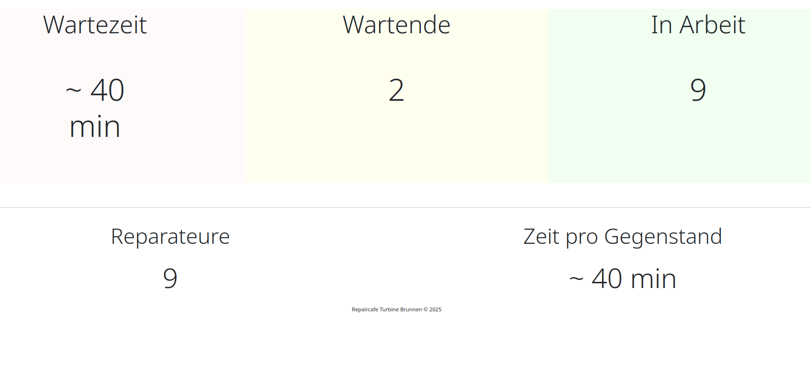
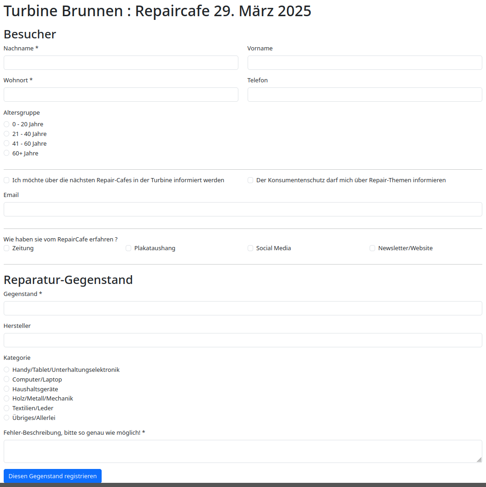
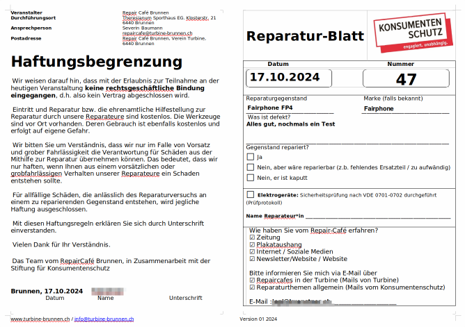
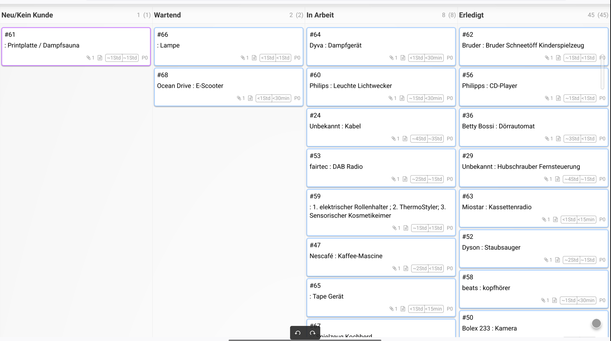

# repaircafe

Hilfstool für unser [Repaircafe](https://www.turbine-brunnen.ch/repaircafe/) (Registrierung, Doc-Creation, Taskboard, Übersicht, Wartezeit)

Dies ist eine Sammlung um eine webbasierte Hilfe für unser Repaircafe anzubieten.  
Das Tool läuft auf einem Raspberry-Pi als Server und bietet folgende Dinge an:

* Webbasierte Registrierung von Kunden und Reparatur-Gegenständen
* √úbertragung der Daten in ein Libreoffice-Document, das wird automatisch durch den Server ausgedruckt
( wir sind noch nicht ganz fertig mit der Digitalisierung ...)
* √úbetragung der Daten in ein Kanban-Board um die Warteschlange, die Reparaturen und den Fortschritt zu visiualisieren
* Übertragung der Daten in eine Datenbank um sie weiter auszuwerten und gesammelt an den Konsumentenschutz zu übertragen (noch nicht, derzeit ist das Kanban-Board die Datenbank...
* Auswertung der Daten und Anzeige in einer √úbersicht
* mehr später, Ideen gibt es noch genug...

## Schema 


## Begrüssungs-Dashboard

Mit diesem Dashboard im Eingangsbereich werden die potentiellen Kunden "begrüsst", so dass sie schon abschätzen können, wie lange sie nach der Registrierung warten müssen, bzw. Kaffee und Kuchen geniessen dürfen




## Registrierungs-Form

Wenn sie die geschätzte Wartezeit nicht abschreckt, können sie sich dann selbst an einem unserer (bis zu 4, je nach Andrang...) Registrierungs-Laptops registrieren.
Natürlich helfen wir bei diesem Schritt auch weiterhin mit mehreren Helfern im Eingangsbereich.   
Wir haben doch oft auch ältere Kunden und Kundinnen.





## Unser Formular 

Beim Abschicken des Formulars wird das Dokument automatisch ausgedruckt und es landet als "Story" in unserem Kanban-Board. Die Gäste müssen dann noch beim "Empfang" vorbei, dort unterschreiben sie die Haftungs-Begrenzung und bekommen einen Pager mit Ihrer Nummer. 

So sieht das Formular dann aus dem Drucker aus:




## Unser Kanban-Board

Das Kanban-Board wird (noch) vom Empfang gesteuert. Bei der Selbst-Registrierung durch die Gäste landen die neu registrierten Gegenstände in der Spalte **Neu/Kein Kunde** und erst nach der Unterschrift zur Haftungs-Begrenzung und der Ausgabe des Pagers wird die Karte in die Spalte **Wartend** verschoben.  
Ab diesem Moment wird die Karte/der Gegenstand dann auch mit in die Berechnung der Wartezeit auf dem Dashboard einbezogen.

Das gleiche Kanbanboard wird in den Reparier-Räumlichkeiten dann auch per Beamer oder zusätzlichen Monitoren den Reparateuren gezeigt, so dass diese wiederum sehen können:

* Wie gross die Schlange am Empfang / im Cafe ist.
* Was als nächstes in "der Queue" ist und vielleicht schon bestimmtes Know-How, das sie haben, nach vorne melden können.





# Stack

Technologisch wird dazu benutzt:

* Raspberry Pi als Server
* Python, Flask, Bootstrap
* [bootstrap-flask](https://github.com/helloflask/bootstrap-flask) Eine Kombination mit templates , Nachfolger von flask-bootstrap. Die Demo-App wurde als Basis verwendet.
* [Kanboard](https://kanboard.org/) (eine Open Source Kanban-Board Implementierung mit Rest/Python-API
* [odfdo](https://github.com/jdum/odfdo) um ein Open/Libreoffice-Document zu "patchen"


# Installation

(Ziel ist es, das alles in ein docker-compose zu packen, momentan ist das nur f¸r das Kanban-Board der Fall, das Python-Programm muss noch von Hand installiert werden) 

* Starten des Kanbanboards : docker-compose / docker compose im Unterverzeichnis kanboard ```docker compose -f kanboard/docker-compose.yml up -d```
* Anlegen eines Projektes und Export des API-Keys
* Übertragen der Daten in Umgebungs-Variablen/.env-File, siehe env-template , bitte befüllen und nach .env umbenennen
* Virtual environment anlegen : ``` python -m venv venv``` (einmalig)
* Virtual environment aktiviriern : ```source venv/bin/activate```
* Requirements installieren:  ```pip install -r requirements.txt``` (einmalig)
* Flask-Server starten : ```python app.py```
* Browser starten, folgende Routes werde darzeit unterst¸tztz:
    * ```localhost:8880``` :  Kanban-Board
    * ```localhost``` : Eingabe-Formular f¸r die Selbstregistrierung
    * ```localhost/overview``` : das ‹bersichts-Dashboard f¸r den Empfang
    * ```localhost/config``` : Konfiguration der angestrebten Reparatur-Dauer und der Anzahl Reparierenden  


# Autostart

Die Installation geht davon aus, dass der Raspberry Pi Server f¸r mehrere Dinge gleichzeitig zust‰ndig ist 

* Bereitstellng des Kanban-Boards
* Bereitstellung der repaircafe Web-App mit Formular, ‹bersicht, Fernsteuerung des Kanban-Boards etc
* Anzeige des ‹bersichts-Dashboards an einem angeschlossenen Monitor

Dazu gibt es ein paar autostart-Helper im Unterverzeichnis ```autostart``` ,  dort befindet sich eine [Readme-Datei](autostart/README-autostart.md)

 


# Ideen / Link-Sammlung / Tipps

## Andere Kanban-Boards

* Basic: https://github.com/ritakurban/Kanban-Board
* Basic: https://github.com/kevinyang372/kanban_board
* Extendend, Trello-artig : https://github.com/FLiotta/Tiquet

## Erweiterung der Anzeige auf Divoom-Pixoo

* https://github.com/roemer/govoom
* https://doc.divoom-gz.com/web/#/12?page_id=219
* https://github.com/Roemer/govoom/wiki/Get-data-from-Home-Assistant
* https://pypi.org/project/pixoo/
* https://github.com/SomethingWithComputers/pixoo

## Tipps 

* Two Forms/ Two Buttons : https://stackoverflow.com/questions/39738069/flask-bootstrap-with-two-forms-in-one-page
* Configuration of Kanboard : https://github.com/kanboard/kanboard/issues/4894
* base64-encode a file : https://gist.github.com/juliensalinas/15789d241f28b1ce45f0c22e11ba894a
* Allow binding on port 80 for normal user : e.g. https://superuser.com/a/1482188


### Die Spalten heissen:
 
* Neu / Kein Kunde
* Warteschlange
* In Arbeit
* Erledigt

(Sollte mal noch per Script automatisiert werden...)


pics/dokument_sm.png
dashboard.png
dokument.png
dokument_sm.png
registrier_formular.png
Repaircafe.drawio.svg
scrumboard.png
